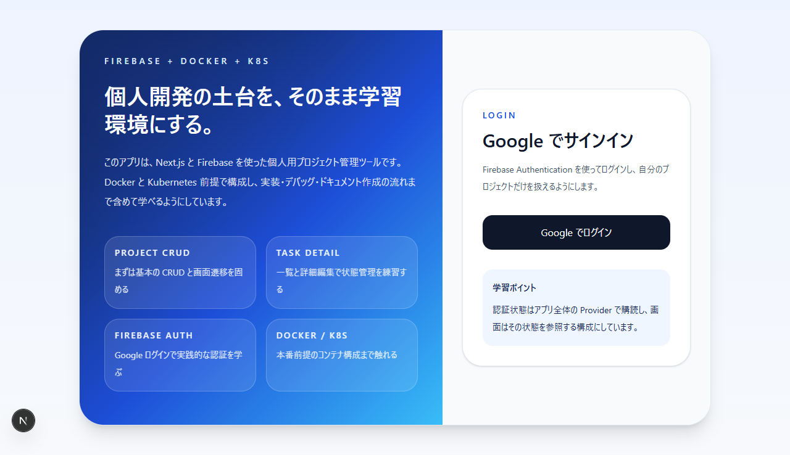

# Personal Project Manager

個人用のプロジェクト・タスク管理 Web アプリ。Firebase Authentication（Google サインイン）と Cloud Firestore をバックエンドに使い、Next.js 16 App Router + TypeScript + Tailwind CSS で実装しています。Docker / Kubernetes 実行にも対応しており、Google Gemini による AI 補助機能を任意で有効化できます。



---

## クイックスタート

```bash
git clone <this-repo>
cd Personal_Project_Manager
npm install
copy .env.example .env.local        # macOS / Linux は cp
# .env.local を Firebase Console / Google AI Studio の値で埋める
npm run dev
```

`http://localhost:3000` を開くと `/login` にリダイレクトされ、Google サインイン後にプロジェクト一覧へ遷移します。Firebase の値が未設定なら案内画面が出るだけでアプリは落ちません。

---

## 主な機能

- Google アカウントでのサインイン / サインアウト
- プロジェクトの作成・更新・削除
- プロジェクト配下のタスクの作成・更新・削除
- タスクのステータス・優先度・期限での絞り込みと並び替え
- タスク一覧とタスク詳細の同時表示
- ヘルスチェック用の `/healthz` エンドポイント（Docker / Kubernetes プローブ向け）
- 任意で有効化できる AI 補助（Gemini）
  - プロジェクト要約
  - 次アクション提案
  - タスク説明文の下書き生成

`.env.local` の値が揃っていない状態でもアプリは起動します。Firebase が未設定ならセットアップ案内画面が出て他の機能は待機状態に、AI が未設定なら AI ボタンが無効になるだけで他の機能は通常どおり動きます。

AI レスポンスは Gemini に `responseMimeType: "application/json"` を渡して構造化出力を要求しているため、`{"summary":"..."}` などのスキーマで安定して返ります。万一モデルが Markdown コードフェンスで包んできた場合に備えて、parser 側でフェンスを剥がすフォールバックも入れてあります（[`lib/ai/schemas.ts`](./lib/ai/schemas.ts)）。

## 技術スタック

- Next.js 16（App Router, `output: "standalone"`）
- React 19
- TypeScript
- Tailwind CSS 4
- Firebase Authentication（Google Sign-In）
- Cloud Firestore
- Google Gemini API（任意）
- Docker / Docker Compose
- Kubernetes

## ルート

| パス | 役割 |
| --- | --- |
| `/` | `/projects` へリダイレクト |
| `/login` | 未認証時のランディング |
| `/projects` | プロジェクト一覧 |
| `/projects/[projectId]` | プロジェクト詳細（タスク一覧 + タスク詳細パネル） |
| `/healthz` | ヘルスチェック（Kubernetes probe 用） |

## アーキテクチャ

### Firebase 設定の注入フロー

1. [`lib/firebase/runtime-config.ts`](./lib/firebase/runtime-config.ts) がサーバー側で環境変数を読み、`FirebaseWebConfig | null` を返す。
2. [`app/layout.tsx`](./app/layout.tsx)（Server Component）がこれを呼び出し、クライアントの [`<Providers>`](./app/providers.tsx) に props として渡す。
3. 必須の環境変数が 1 つでも欠けていれば `null` が渡り、アプリは「未設定」状態で動作する（`isConfigured: false`）。

### 認証と Firebase インスタンス管理

- `app/providers.tsx` がアプリ全体の `AuthContext` を保持する。
- Firebase の `auth` / `firestore` インスタンスも同じ context 経由で配布されるため、各画面は `useAuth()` から取得する。
- Firebase SDK の初期化は [`lib/firebase/client.ts`](./lib/firebase/client.ts) の `getFirebaseServices()` が config をキーにキャッシュして管理する。

### データモデル

Firestore のコレクション構成:

- `projects`
- `projects/{projectId}/tasks`

TypeScript の型・ラベル定数は [`types/index.ts`](./types/index.ts) に集約（`Project` / `Task` / `TaskStatus` / `TaskPriority` / `TaskInput` / `ProjectInput` / `TaskFilters` / `TASK_STATUS_OPTIONS` / `TASK_PRIORITY_OPTIONS`）。

Repository 層:

- [`lib/firestore/mappers.ts`](./lib/firestore/mappers.ts) — `DocumentSnapshot` → 型付きオブジェクト変換
- [`lib/repositories/projects.ts`](./lib/repositories/projects.ts) — `projects` の CRUD / `onSnapshot` 購読
- [`lib/repositories/tasks.ts`](./lib/repositories/tasks.ts) — サブコレクションの CRUD / `onSnapshot` 購読

各 repository 関数は `Firestore` インスタンスを第一引数に取る。リアルタイム購読は `onSnapshot` を使い `Unsubscribe` を返す。プロジェクト削除時は Firestore がサブコレクションを自動削除しないため、`deleteProject` が先にタスクを手動削除する。

### セキュリティルール

[`firestore.rules`](./firestore.rules) で `ownerUid` ベースのアクセス制御を行う。

- プロジェクト: 作成時に `request.resource.data.ownerUid == request.auth.uid`、それ以外の操作は所有者のみ許可
- タスク（サブコレクション）: 親プロジェクトの所有者のみ CRUD 可能

### AI 連携

AI は任意機能。`AI_PROVIDER` / `GEMINI_API_KEY` / `GEMINI_MODEL` が揃っていれば Route Handler 経由で有効化される。

- ランタイム設定: [`lib/ai/runtime-config.ts`](./lib/ai/runtime-config.ts)
- プロバイダ抽象: [`lib/ai/provider.ts`](./lib/ai/provider.ts)
- Gemini 実装: [`lib/ai/gemini.ts`](./lib/ai/gemini.ts)
- プロンプト生成: [`lib/ai/prompts.ts`](./lib/ai/prompts.ts)
- 入出力スキーマとバリデーション: [`lib/ai/schemas.ts`](./lib/ai/schemas.ts)
- 認証ヘルパー: [`lib/ai/auth.ts`](./lib/ai/auth.ts) / [`lib/firebase/admin.ts`](./lib/firebase/admin.ts)
- API ルート:
  - [`POST /api/ai/summarize-project`](./app/api/ai/summarize-project/route.ts)
  - [`POST /api/ai/suggest-next-actions`](./app/api/ai/suggest-next-actions/route.ts)
  - [`POST /api/ai/draft-task`](./app/api/ai/draft-task/route.ts)

AI Route Handler は Firebase ID Token の検証を必須とする。クライアントは `Authorization: Bearer <idToken>` ヘッダを添付する必要があり、サーバー側は [`lib/firebase/admin.ts`](./lib/firebase/admin.ts) が Google の X.509 公開証明書で JWT を検証する（外部依存なし、Node 標準 `crypto` のみ）。検証に必要な Project ID は既存の `FIREBASE_PROJECT_ID` を流用するため、追加の環境変数は不要。

エラー応答は次のとおり:

| ステータス | 原因 |
| --- | --- |
| `401` | Authorization ヘッダ欠落 / Token が不正・期限切れ・署名不一致 |
| `503` | AI 設定未完了、または `FIREBASE_PROJECT_ID` 未設定 |
| `502` | Gemini API への通信失敗・タイムアウト |
| `400` | リクエストボディの形式不正 |

`docs/ai/` 以下の資料は過去の Gemma ローカル LLM 運用時のメモで、現在の設定フローは Gemini を正とする。

## 環境変数

`.env.example` を `.env.local` にコピーして値を埋める。

### Firebase（必須: これが無いと認証と Firestore は機能しない）

- `FIREBASE_API_KEY`
- `FIREBASE_AUTH_DOMAIN`
- `FIREBASE_PROJECT_ID`
- `FIREBASE_STORAGE_BUCKET`
- `FIREBASE_MESSAGING_SENDER_ID`
- `FIREBASE_APP_ID`

### AI（任意: 無ければ AI 機能だけ無効）

- `AI_PROVIDER=gemini`
- `GEMINI_MODEL`（例: `gemini-2.0-flash`）
- `GEMINI_API_KEY`
- `AI_REQUEST_TIMEOUT_MS`（省略時 `30000`）
- `AI_MAX_INPUT_TASKS`（省略時 `100`）

## ローカル開発

```bash
npm install
cp .env.example .env.local   # Windows の場合は copy
# .env.local に Firebase Console の値を記入
npm run dev
```

`http://localhost:3000` にアクセス。

### 利用可能なスクリプト

| コマンド | 内容 |
| --- | --- |
| `npm run dev` | 開発サーバー起動 |
| `npm run build` | プロダクションビルド（`.next/standalone` を生成） |
| `npm run start` | `.next/standalone/server.js` を Node で実行 |
| `npm run lint` / `npm run typecheck` | 型チェック（`tsc --noEmit`） |
| `npm run firebase:login` | Firebase CLI ログイン（`npx firebase-tools login`） |
| `npm run firebase:use` | Firebase プロジェクト切り替え |
| `npm run firebase:deploy:firestore` | `firestore.rules` をデプロイ |

## Firebase セットアップ

必要なサービスは Authentication（Google）と Cloud Firestore のみ。Firebase Hosting は使用しない。詳しい手順は [`docs/firebase-setup.md`](./docs/firebase-setup.md) を参照。

1. Firebase Console でプロジェクトを作成し、Web アプリを登録
2. 取得した設定値を `.env.local` に転記
3. Authentication → Google プロバイダを有効化
4. Firestore を Production モードで作成（推奨リージョン: `asia-northeast1`）
5. Firestore → Rules に [`firestore.rules`](./firestore.rules) の内容を反映
6. ローカルから Google サインインが失敗する場合は、Authentication → Settings → Authorized domains に `localhost` を追加

Firebase CLI からルールをデプロイする場合は `.firebaserc.example` を `.firebaserc` にコピーしてプロジェクト ID を書き換え、`npm run firebase:deploy:firestore` を実行する。

## Docker

### 直接実行

```bash
docker build -t personal-project-manager .
docker run --rm -p 3000:3000 --env-file .env.local personal-project-manager
```

### Docker Compose

```bash
docker compose up --build
```

関連ファイル:

- [`Dockerfile`](./Dockerfile) — マルチステージ構成で `.next/standalone` を最小イメージに配置
- [`docker-compose.yml`](./docker-compose.yml) — `.env.local` を読み込んでポート 3000 を公開

## Kubernetes

マニフェストは [`k8s/`](./k8s) に配置。前提:

- コンテナは 3000 番ポートで待ち受け
- liveness / readiness プローブは `/healthz`
- 環境変数は Secret `personal-project-manager-env` から注入
- Ingress ホストはプレースホルダのため、実運用前に書き換える

```bash
kubectl apply -f k8s/secret.example.yaml    # 実値で書き換えてから apply する
kubectl apply -f k8s/deployment.yaml
kubectl apply -f k8s/service.yaml
kubectl apply -f k8s/ingress.yaml
```

- `your-registry/personal-project-manager:replace-with-version` の部分は、デプロイ前に push 済みの不変イメージタグへ書き換えること。
- Kubernetes 上でも AI 機能を有効にする場合は、Secret `personal-project-manager-env` に Gemini 関連の環境変数も追加する。

## ディレクトリ構成

```
app/
  layout.tsx                # Server Component。Firebase 設定を読み Providers に注入
  providers.tsx             # AuthContext（auth / firestore / user / signIn / signOut / isAiConfigured）
  page.tsx                  # "/" → "/projects" リダイレクト
  login/page.tsx            # 未認証時のランディング
  projects/
    page.tsx                # プロジェクト一覧
    [projectId]/page.tsx    # プロジェクト詳細
  api/
    ai/{summarize-project,suggest-next-actions,draft-task}/route.ts
  healthz/route.ts          # ヘルスチェック
components/                 # 共有 UI（認証シェル、タスク一覧、タスク詳細、EmptyState 等）
lib/
  firebase/                 # SDK 初期化と runtime 設定 / ID Token 検証
  firestore/mappers.ts      # Snapshot → 型付きオブジェクト変換
  repositories/             # projects / tasks の CRUD と onSnapshot 購読
  ai/                       # runtime-config / provider 抽象 / Gemini 実装 / プロンプト / スキーマ
  date.ts                   # 日付比較などのユーティリティ
types/index.ts              # 型定義とラベル定数の集約
k8s/                        # Deployment / Service / Ingress / Secret サンプル
docs/                       # 要件・開発フロー・Firebase セットアップ・AI 歴史資料
tools/local-llm-server/     # 過去の Gemma ローカル LLM 検証用スクリプト（現行運用では未使用）
next.config.ts              # Next.js 設定（output: "standalone" など）
firebase.json               # Firebase CLI から firestore.rules をデプロイするための設定
firestore.rules             # ownerUid ベースのアクセス制御
.firebaserc.example         # コピーしてプロジェクト ID を記入する
```

## ドキュメント

- [要件メモ](./docs/requirements.md)
- [開発フロー・役割分担](./docs/dev-workflow.md)
- [Firebase セットアップ手順](./docs/firebase-setup.md)

## 役割分担（開発フロー）

[`docs/dev-workflow.md`](./docs/dev-workflow.md) を正として要約:

- **Claude Code** — 要件整理、実装順の分解、レビュー観点の洗い出し、仕様言語化
- **Codex** — 機能実装、型整理、リファクタ、テスト・ビルド修正
- **Gemini** — docs 下書き、低リスクな UI 文言修正、小さく閉じた実装

Firestore データモデル変更・認証まわり・Docker / Kubernetes 本番設定・複数ファイルにまたがる状態管理変更は Gemini に任せない。

## 動作確認手順

ローカルでデプロイ前の最終確認をする際の手順。

```bash
npm run lint        # 型チェック (tsc --noEmit) — 0 エラーで通ること
npm run build       # プロダクションビルド — .next/standalone が生成されること
npm run dev         # 開発サーバー
```

ブラウザで以下を確認:

| 確認項目 | 期待結果 |
| --- | --- |
| `GET /healthz` | `200 {"status":"ok",...}` |
| `GET /` | `307 Location: /projects` |
| 未認証で `/projects` にアクセス | `/login` に自動遷移する |
| `/login` で「Google でログイン」 | popup でサインインでき、`/projects` に遷移する |
| プロジェクト作成・タスク追加・編集・削除 | UI 操作のたびに Firestore に反映される（リアルタイム購読） |
| AI 要約 / 次アクション提案 / タスク下書き | プレーンテキストで結果が表示される（JSON 文字列が見えたら不具合） |
| サインアウト | `/login` に戻り、再アクセスで保護ルートに入れない |

AI ボタンを押した際にサーバー側でエラーが出たら、`Authorization: Bearer <idToken>` の付与漏れか、`FIREBASE_PROJECT_ID` の不一致を疑う（[`lib/firebase/admin.ts`](./lib/firebase/admin.ts) が JWT の `aud` を検証している）。

## トラブルシューティング

| 症状 | 対処 |
| --- | --- |
| Google サインインが popup で失敗する | Firebase Console → Authentication → Settings → Authorized domains に `localhost`（および本番ドメイン）を追加する |
| Firestore 書き込みが `permission-denied` で落ちる | [`firestore.rules`](./firestore.rules) を `npm run firebase:deploy:firestore` でデプロイし忘れていないか確認 |
| AI ボタンが押せない（無効化されている） | `.env.local` の `AI_PROVIDER` / `GEMINI_API_KEY` / `GEMINI_MODEL` が揃っているか、再起動したかを確認 |
| AI レスポンスに `{"summary":"..."}` のような JSON 文字列が表示される | サーバー再起動で最新の [`lib/ai/gemini.ts`](./lib/ai/gemini.ts) と [`lib/ai/schemas.ts`](./lib/ai/schemas.ts) を読み込ませる |
| `/api/ai/*` が `401` を返す | クライアントの `Authorization` ヘッダ欠落、または ID Token の期限切れ。サインインし直してリトライ |
| `/api/ai/*` が `503` を返す | サーバー側の AI 設定が読めていない。`FIREBASE_PROJECT_ID` も含めた環境変数を再確認 |
| ビルド時に `multiple lockfiles detected` の警告が出る | 親ディレクトリ（例: `C:\Users\<user>\package-lock.json`）の不要な lockfile を削除するか、`next.config.ts` で `turbopack.root` を明示する |

## 現在の運用状態

- Next.js のビルドは通り、`.next/standalone` まで生成される
- 環境変数が未設定でもアプリは起動する（機能は段階的に無効化される）
- ヘルスチェック `/healthz` がプロダクション応答する
- Firebase Authentication / Firestore / Gemini API への疎通を実機で確認済み
- Firestore ルールのデプロイ経路（Firebase CLI）は準備済み（`.firebaserc` を作成して `npm run firebase:deploy:firestore`）
- Docker / Kubernetes マニフェストは整備済みだが、本番のレジストリタグ・Ingress ホスト・Secret は実値で置換する必要がある
- AI はオプション扱いで、現在の正系は Gemini（`gemini-2.0-flash` 既定）
- `docs/ai/` および `tools/local-llm-server/` 配下の Gemma 時代のメモ・スクリプトは歴史的資料として残しており、セットアップの第一出典ではない
